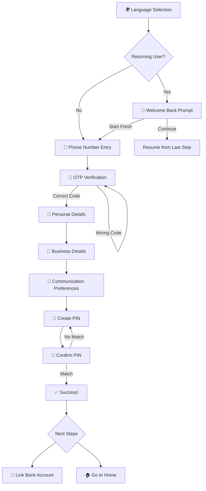
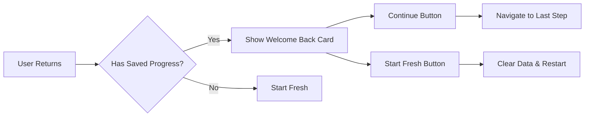
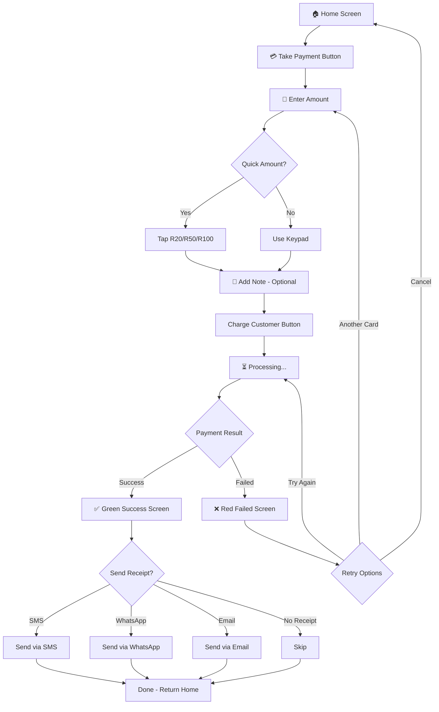
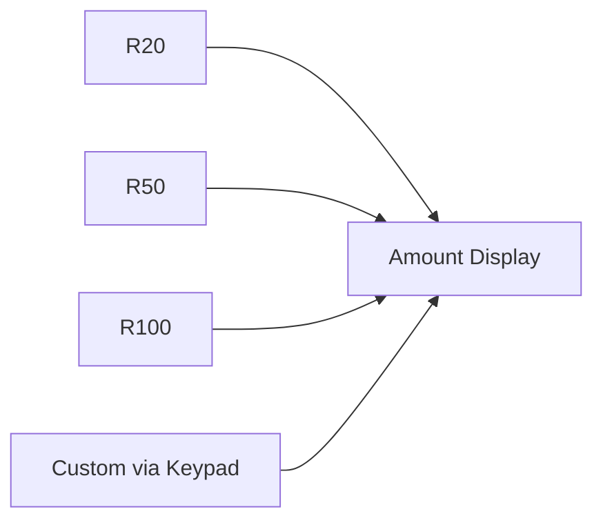
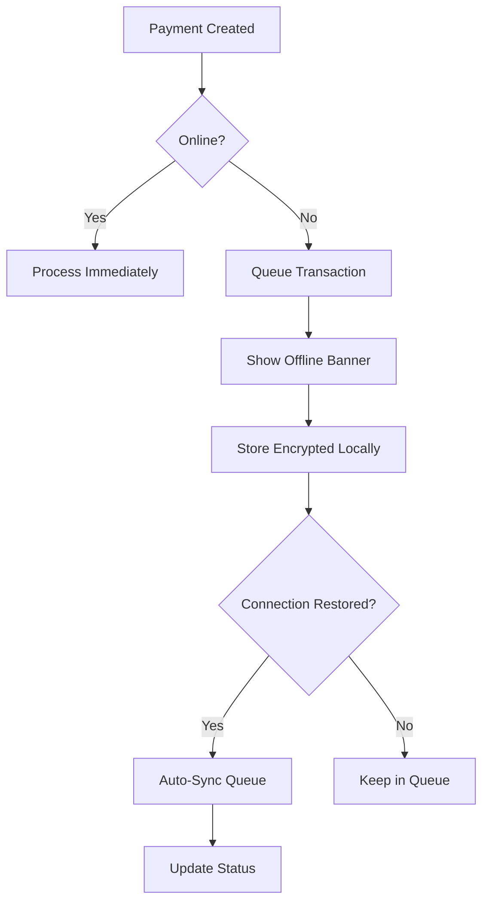
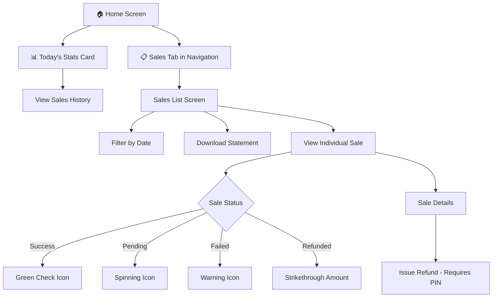
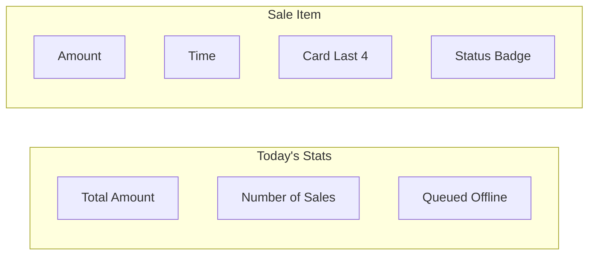
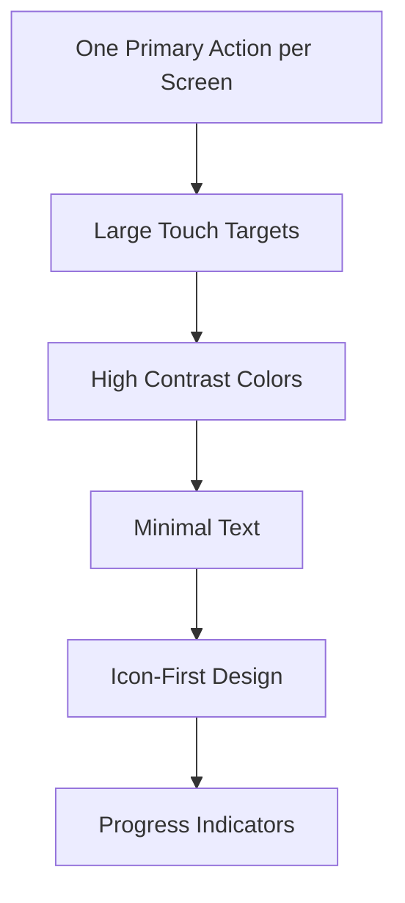
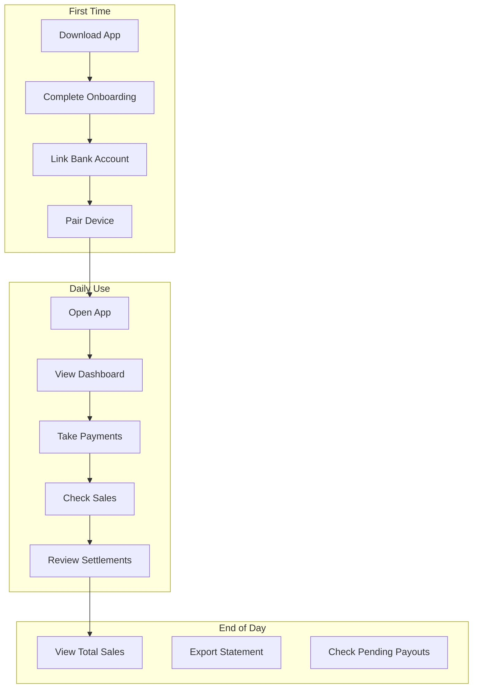

# Patela Customer Journey

> **"Built for the Hustle"** - A payment solution designed for street vendors with low literacy, supporting multiple languages and offline-first operation.

---

## 📱 Overview

Patela guides vendors through three core journeys:

1. **Onboarding** - Getting started with the app
2. **Taking Payments** - Processing customer transactions
3. **Viewing Sales** - Tracking business performance

---

## 🚀 Journey 1: Onboarding

### Flow Diagram

### Step-by-Step Process

| Step | Screen | User Action | Design Principle |
|------|--------|-------------|------------------|
| 1 | **Language Selection** | Tap preferred language (English, isiZulu, Sesotho, Xitsonga) | Large buttons, flag icons |
| 2 | **Phone Entry** | Enter 10-digit SA mobile number | Big keypad, clear format hint |
| 3 | **OTP Verification** | Enter 6-digit code from SMS | Auto-focus, resend option |
| 4 | **Personal Details** | Enter name, optional ID number | One field at a time |
| 5 | **Business Details** | Select business type, enter name | Icon-based categories |
| 6 | **Communication Prefs** | Choose SMS, WhatsApp, or Email | Multiple selection allowed |
| 7 | **Create PIN** | Enter 4-digit PIN | Secure dots, keypad only |
| 8 | **Confirm PIN** | Re-enter same PIN | Error if mismatch |
| 9 | **Success** | View completion message | Green checkmark, celebration |

### Resume Onboarding Feature

**Key Features:**
- Progress saved to local storage automatically
- Resume prompt shows on Language Selection page
- Option to continue or start fresh
- Data cleared on successful completion

---

## 💳 Journey 2: Taking a Payment

### Flow Diagram

### Payment Screen States

| State | Visual | User Action |
|-------|--------|-------------|
| **Amount Entry** | Large display showing R0.00 | Tap keypad or quick amounts |
| **Processing** | Spinning loader, amount shown | Wait for card tap/insert |
| **Success** | Big green screen, checkmark | Choose receipt option |
| **Failed** | Big red screen, X icon | Retry, try another card, or cancel |

### Quick Amount Buttons

### Offline Payment Handling

---

## 📊 Journey 3: Viewing Payment History

### Flow Diagram

### Sales Dashboard Components

### Sale Status Types

| Status | Icon | Color | Description |
|--------|------|-------|-------------|
| **Success** | ✓ Checkmark | Green | Payment completed |
| **Pending** | ↻ Spinning | Yellow | Processing |
| **Failed** | ⚠ Warning | Red | Declined/Error |
| **Queued** | 🕐 Clock | Gray | Waiting for sync |
| **Refunded** | ↻ Arrow | Gray | Money returned |

---

## 🎨 Design Principles Applied

### Visual Hierarchy

### Color Coding System

| Context | Color | Meaning |
|---------|-------|---------|
| **Success** | 🟢 Green | Money received, action complete |
| **Error** | 🔴 Red | Declined, failed, needs attention |
| **Warning** | 🟡 Yellow | Processing, pending |
| **Neutral** | ⚪ Gray | Inactive, historical |
| **Primary** | 🟣 Purple | Brand, main actions |
| **Accent** | 🔵 Cyan | Highlights, secondary actions |

### Accessibility Features

- **Large Buttons**: Minimum 48px touch targets
- **High Contrast**: WCAG AA compliant
- **Multi-Language**: 4 SA languages supported
- **Voice Prompts**: Optional audio guidance
- **Offline First**: Works without internet

---

## 🔄 Complete User Flow

---

## 📱 Screen Inventory

### Onboarding Screens
1. Splash Screen
2. Language Selection
3. Phone Number Entry
4. OTP Verification
5. Personal Details (3 substeps)
6. PIN Creation
7. PIN Confirmation
8. Success Screen

### Payment Screens
1. Home Dashboard
2. Payment Amount Entry
3. Payment Processing
4. Payment Success
5. Payment Failed
6. Receipt Options

### Sales Screens
1. Sales List
2. Sale Detail
3. Refund Confirmation
4. Export Options

### Account Screens
1. Account Settings
2. Bank Account Management
3. Device Management
4. Help & Support

---

## 📋 Summary

Patela's customer journey is designed around three core principles:

1. **Simplicity** - One action per screen, minimal text
2. **Accessibility** - Large buttons, multiple languages, offline support
3. **Trust** - Clear feedback, secure PIN protection, transparent status

The flow prioritizes getting vendors up and running quickly while providing the tools they need to manage their business effectively.

---

*Document generated for Patela - "Built for the Hustle"*
