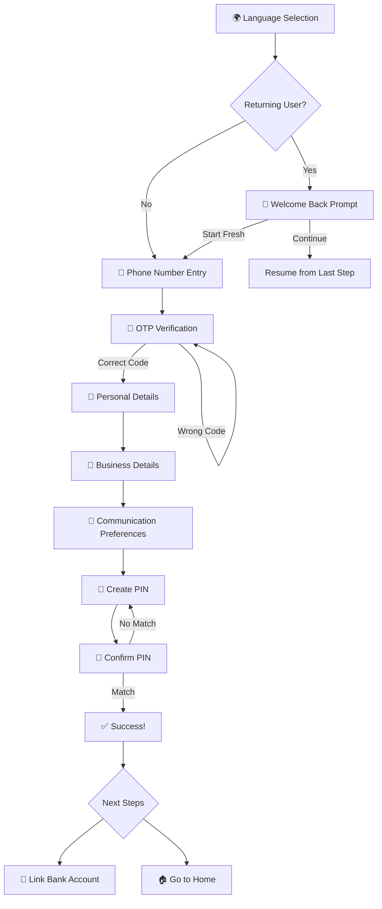
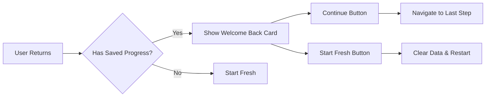
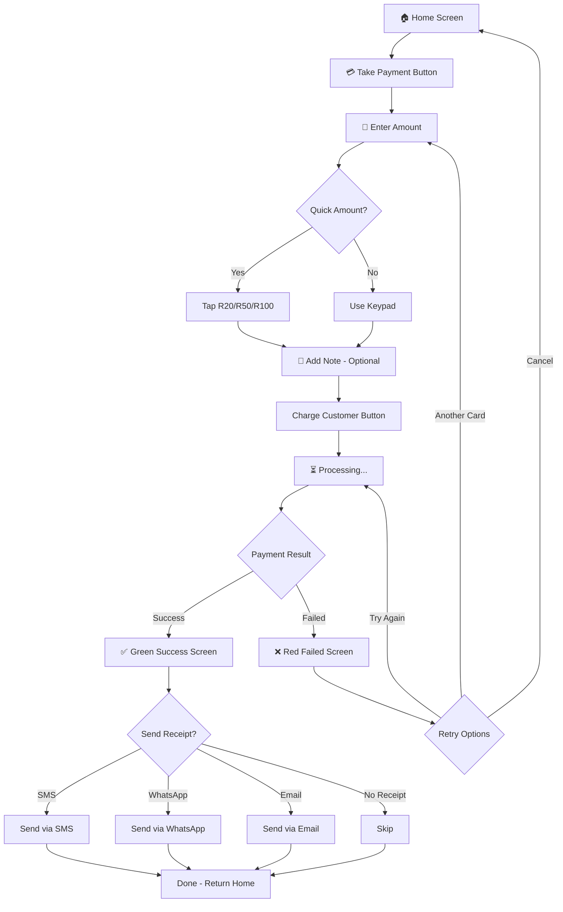
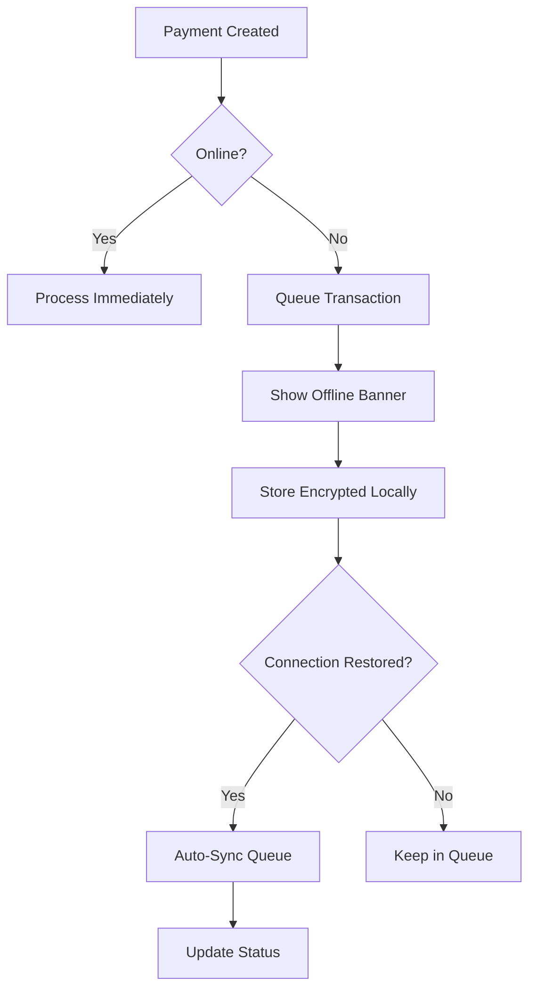
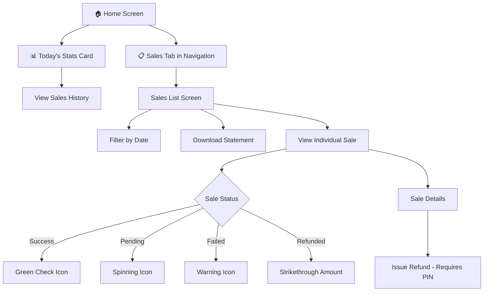
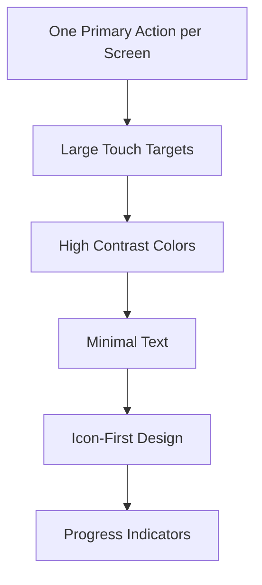

# Patela - Complete Product Documentation

> **"Built for the Hustle"**  
> A payment solution designed for street vendors in South Africa

---

## Table of Contents

1. [Executive Summary](#1-executive-summary)
2. [Customer Journey](#2-customer-journey)
   - 2.1 [Onboarding Flow](#21-onboarding-flow)
   - 2.2 [Payment Processing](#22-payment-processing)
   - 2.3 [Sales History](#23-sales-history)
3. [User Stories & Acceptance Criteria](#3-user-stories--acceptance-criteria)
   - 3.1 [Epic 1: Onboarding & Registration](#31-epic-1-onboarding--registration)
   - 3.2 [Epic 2: Payment Processing](#32-epic-2-payment-processing)
   - 3.3 [Epic 3: Device Management](#33-epic-3-device-management)
   - 3.4 [Epic 4: Bank Account Linking](#34-epic-4-bank-account-linking)
   - 3.5 [Epic 5: Sales & History](#35-epic-5-sales--history)
   - 3.6 [Epic 6: Offline Support](#36-epic-6-offline-support)
   - 3.7 [Epic 7: Multi-Language Support](#37-epic-7-multi-language-support)
   - 3.8 [Epic 8: Security](#38-epic-8-security)
   - 3.9 [Epic 9: Help & Support](#39-epic-9-help--support)
4. [Design Principles](#4-design-principles)
5. [Screen Inventory](#5-screen-inventory)
6. [Appendix](#6-appendix)

---

## 1. Executive Summary

### Purpose
Patela is a mobile payment solution designed specifically for street vendors in South Africa with low literacy levels. The application enables vendors to accept card payments, track sales, and manage their business with minimal complexity.

### Target Audience
- Street vendors operating in informal markets
- Users with low literacy levels
- Vendors requiring offline-first operation
- Multi-language speakers (English, isiZulu, Sesotho, Xitsonga)

### Core Features
| Feature | Description |
|---------|-------------|
| **Simple Onboarding** | One question per screen, large icons, progress indicators |
| **Payment Processing** | Quick amount buttons, clear success/failure feedback |
| **Offline Support** | Queue transactions when offline, auto-sync when connected |
| **Multi-Language** | 4 South African languages supported |
| **PIN Security** | 4-digit PIN for sensitive operations |

### Technology Stack
- **Frontend**: React, TypeScript, Tailwind CSS
- **Routing**: React Router
- **Storage**: Local storage for offline data persistence
- **Design**: Mobile-first, high contrast, large touch targets

---

## 2. Customer Journey

### 2.1 Onboarding Flow

#### Flow Diagram

#### Step-by-Step Process

| Step | Screen | User Action | Design Principle |
|------|--------|-------------|------------------|
| 1 | Language Selection | Tap preferred language | Large buttons, flag icons |
| 2 | Phone Entry | Enter 10-digit mobile number | Big keypad, clear format |
| 3 | OTP Verification | Enter 6-digit SMS code | Auto-focus, resend option |
| 4 | Personal Details | Enter name, optional ID | One field at a time |
| 5 | Business Details | Select type, enter name | Icon-based categories |
| 6 | Communication Prefs | Choose contact methods | Multiple selection |
| 7 | Create PIN | Enter 4-digit PIN | Secure dots display |
| 8 | Confirm PIN | Re-enter same PIN | Error if mismatch |
| 9 | Success | View completion | Green checkmark |

#### Resume Onboarding Feature

---

### 2.2 Payment Processing

#### Flow Diagram

#### Payment Screen States

| State | Visual | User Action |
|-------|--------|-------------|
| **Amount Entry** | Large display R0.00 | Tap keypad or quick amounts |
| **Processing** | Spinning loader | Wait for card tap/insert |
| **Success** | Big green screen | Choose receipt option |
| **Failed** | Big red screen | Retry or cancel |

#### Offline Payment Handling

---

### 2.3 Sales History

#### Flow Diagram

#### Sale Status Types

| Status | Icon | Color | Description |
|--------|------|-------|-------------|
| **Success** | ✓ Checkmark | Green | Payment completed |
| **Pending** | ↻ Spinning | Yellow | Processing |
| **Failed** | ⚠ Warning | Red | Declined/Error |
| **Queued** | 🕐 Clock | Gray | Waiting for sync |
| **Refunded** | ↻ Arrow | Gray | Money returned |

---

## 3. User Stories & Acceptance Criteria

### 3.1 Epic 1: Onboarding & Registration

#### US-1.1: Language Selection
**As a** new vendor  
**I want to** select my preferred language  
**So that** I can use the app in a language I understand

**Acceptance Criteria:**
| # | Criterion |
|---|-----------|
| 1 | Display 4 language options: English, isiZulu, Sesotho, Xitsonga |
| 2 | Each option shows language name in that language |
| 3 | Large, easy-to-tap buttons (minimum 48px height) |
| 4 | Selected language persists throughout the app |
| 5 | Progress indicator shows step 1 of onboarding |

---

#### US-1.2: Resume Onboarding
**As a** returning user who didn't complete onboarding  
**I want to** continue from where I left off  
**So that** I don't have to start over

**Acceptance Criteria:**
| # | Criterion |
|---|-----------|
| 1 | System detects saved onboarding progress on app open |
| 2 | "Welcome Back" prompt displays with user's saved phone number |
| 3 | "Continue" button navigates to last incomplete step |
| 4 | "Start Fresh" button clears saved data and restarts |
| 5 | All previously entered data is pre-populated |

---

#### US-1.3: Phone Number Entry
**As a** new vendor  
**I want to** enter my phone number  
**So that** I can verify my identity

**Acceptance Criteria:**
| # | Criterion |
|---|-----------|
| 1 | Large keypad for number entry |
| 2 | Phone number format hint displayed (e.g., 0XX XXX XXXX) |
| 3 | Validation for 10-digit SA mobile numbers |
| 4 | Clear error message for invalid numbers |
| 5 | "Continue" button disabled until valid number entered |

---

#### US-1.4: OTP Verification
**As a** vendor  
**I want to** verify my phone number with a code  
**So that** my account is secure

**Acceptance Criteria:**
| # | Criterion |
|---|-----------|
| 1 | 6-digit OTP input with auto-focus on first field |
| 2 | Auto-advance to next field after each digit |
| 3 | "Resend Code" option with 30-second cooldown |
| 4 | Clear error message for incorrect code |
| 5 | Maximum 3 attempts before temporary lockout |
| 6 | Success navigates to Personal Details |

---

#### US-1.5: Personal Details Collection
**As a** vendor  
**I want to** provide my personal and business information  
**So that** my account is properly set up

**Acceptance Criteria:**
| # | Criterion |
|---|-----------|
| 1 | Collect first name (required) and last name (required) |
| 2 | SA ID number field (optional) with validation |
| 3 | Business name field (required) |
| 4 | Business type selection with icons (Food, Clothing, Electronics, Services, Other) |
| 5 | Communication preference multi-select (SMS, WhatsApp, Email) |
| 6 | Progress saved after each substep |

---

#### US-1.6: PIN Creation
**As a** vendor  
**I want to** create a 4-digit PIN  
**So that** I can secure sensitive actions

**Acceptance Criteria:**
| # | Criterion |
|---|-----------|
| 1 | 4-digit PIN entry with secure dot display |
| 2 | Numeric keypad only |
| 3 | PIN confirmation step (re-enter same PIN) |
| 4 | Clear error message if PINs don't match |
| 5 | Success navigates to onboarding complete screen |
| 6 | PIN stored securely (not in plain text) |

---

#### US-1.7: Onboarding Success
**As a** vendor who completed onboarding  
**I want to** see a success confirmation  
**So that** I know I'm ready to use the app

**Acceptance Criteria:**
| # | Criterion |
|---|-----------|
| 1 | Large green checkmark animation |
| 2 | Success message in selected language |
| 3 | Clear next steps: "Link Bank" and "Go to Home" |
| 4 | Onboarding data cleared from local storage |
| 5 | User can navigate to either option |

---

### 3.2 Epic 2: Payment Processing

#### US-2.1: Take Payment
**As a** vendor  
**I want to** enter a payment amount quickly  
**So that** I can charge my customer

**Acceptance Criteria:**
| # | Criterion |
|---|-----------|
| 1 | Large "Take Payment" button on home screen |
| 2 | Amount display with large, clear numbers |
| 3 | Quick amount buttons (R20, R50, R100) |
| 4 | Numeric keypad for custom amounts |
| 5 | Optional note field for transaction description |
| 6 | "Charge Customer" button activates when amount > 0 |
| 7 | Maximum amount limit enforced |

---

#### US-2.2: Payment Success
**As a** vendor  
**I want to** see clear confirmation when payment succeeds  
**So that** I know the money was received

**Acceptance Criteria:**
| # | Criterion |
|---|-----------|
| 1 | Full-screen green success indicator |
| 2 | Large checkmark animation |
| 3 | Amount displayed prominently |
| 4 | Optional note shown if entered |
| 5 | Receipt options: SMS, WhatsApp, Email, No Receipt |
| 6 | "Done" button returns to home |

---

#### US-2.3: Payment Failed
**As a** vendor  
**I want to** understand why a payment failed  
**So that** I can help my customer

**Acceptance Criteria:**
| # | Criterion |
|---|-----------|
| 1 | Full-screen red failure indicator |
| 2 | Simple, human-readable error message |
| 3 | "Try Again" button to retry same card |
| 4 | "Try Another Card" button to start over |
| 5 | "Cancel" button to exit payment flow |
| 6 | No technical jargon in error messages |

---

### 3.3 Epic 3: Device Management

#### US-3.1: Device Pairing via QR Code
**As a** vendor  
**I want to** pair my payment device by scanning a QR code  
**So that** setup is quick and easy

**Acceptance Criteria:**
| # | Criterion |
|---|-----------|
| 1 | Camera permission requested with clear explanation |
| 2 | QR scanner with visual frame guide |
| 3 | Device info displayed after scan (name, battery, status) |
| 4 | Confirmation button to complete pairing |
| 5 | Success animation and message |
| 6 | Device appears in Device Management screen |

---

#### US-3.2: Device Pairing via Bluetooth
**As a** vendor  
**I want to** pair my device via Bluetooth as a fallback  
**So that** I can pair even without QR code

**Acceptance Criteria:**
| # | Criterion |
|---|-----------|
| 1 | Bluetooth permission requested with clear explanation |
| 2 | Scanning animation while searching |
| 3 | Only Patela devices shown in list |
| 4 | Device selection with visual confirmation |
| 5 | Physical confirmation required on device |
| 6 | Success message after pairing complete |

---

#### US-3.3: Device Unpair
**As a** vendor  
**I want to** unpair my device  
**So that** I can pair a different device

**Acceptance Criteria:**
| # | Criterion |
|---|-----------|
| 1 | Unpair option in Device Management |
| 2 | PIN required to confirm unpair |
| 3 | Clear warning about unpair consequences |
| 4 | Confirmation dialog before proceeding |
| 5 | Success message after unpair |
| 6 | Device removed from management screen |

---

#### US-3.4: Device Transfer
**As a** vendor  
**I want to** transfer my device to another vendor  
**So that** I can sell or give away my device

**Acceptance Criteria:**
| # | Criterion |
|---|-----------|
| 1 | Generate one-time transfer code |
| 2 | Code expires in 10 minutes |
| 3 | Device cannot process payments while transfer pending |
| 4 | Clear instructions for new owner |
| 5 | Transfer completes when new owner enters code |
| 6 | Original owner notified of transfer completion |

---

### 3.4 Epic 4: Bank Account Linking

#### US-4.1: Link Bank Account
**As a** vendor  
**I want to** link my bank account  
**So that** I can receive my payouts

**Acceptance Criteria:**
| # | Criterion |
|---|-----------|
| 1 | Option to scan bank card or enter manually |
| 2 | Bank selection from list of SA banks |
| 3 | Account number and type fields |
| 4 | Account holder name verification |
| 5 | Terms and conditions acceptance |
| 6 | Submission confirmation |

---

#### US-4.2: Bank Card Scan
**As a** vendor  
**I want to** scan my bank card  
**So that** I don't have to type account details

**Acceptance Criteria:**
| # | Criterion |
|---|-----------|
| 1 | Camera permission requested |
| 2 | Card alignment guide displayed |
| 3 | Auto-detect card number |
| 4 | Pre-fill form with scanned details |
| 5 | Allow manual correction if scan incorrect |
| 6 | Fallback to manual entry option |

---

#### US-4.3: Bank Verification
**As a** vendor  
**I want to** verify my bank account  
**So that** my payouts are secure

**Acceptance Criteria:**
| # | Criterion |
|---|-----------|
| 1 | Instant verification attempted first |
| 2 | If instant fails, offer proof upload |
| 3 | Accept bank statement or proof of account |
| 4 | Clear status indicators (Pending, Verified, Failed) |
| 5 | Manual review fallback for failed verifications |
| 6 | Notification when verification complete |

---

### 3.5 Epic 5: Sales & History

#### US-5.1: View Today's Stats
**As a** vendor  
**I want to** see my sales summary at a glance  
**So that** I know how my business is doing

**Acceptance Criteria:**
| # | Criterion |
|---|-----------|
| 1 | Today's total sales amount displayed prominently |
| 2 | Number of successful transactions |
| 3 | Queued offline transactions count (if any) |
| 4 | Refunds amount (if any) |
| 5 | Net amount calculation |
| 6 | Tap to view detailed sales list |

---

#### US-5.2: View Sales History
**As a** vendor  
**I want to** see my past transactions  
**So that** I can track my business

**Acceptance Criteria:**
| # | Criterion |
|---|-----------|
| 1 | List of all transactions sorted by date/time |
| 2 | Each item shows: amount, time, status, card last 4 digits |
| 3 | Status icon color-coded (green/yellow/red/gray) |
| 4 | Filter by date range |
| 5 | Tap transaction for details |
| 6 | Pull to refresh functionality |

---

#### US-5.3: Export Statement
**As a** vendor  
**I want to** export my sales statement  
**So that** I have records for my business

**Acceptance Criteria:**
| # | Criterion |
|---|-----------|
| 1 | Export button in sales history |
| 2 | PIN required to export |
| 3 | Date range selection |
| 4 | Format options (PDF/CSV) |
| 5 | Download or share via email/WhatsApp |
| 6 | Statement includes all transaction details |

---

### 3.6 Epic 6: Offline Support

#### US-6.1: Offline Operation
**As a** vendor  
**I want to** use the app without internet  
**So that** I can still accept payments

**Acceptance Criteria:**
| # | Criterion |
|---|-----------|
| 1 | Offline banner displayed when no connection |
| 2 | Can view cached dashboard and totals |
| 3 | Can create new sales (queued) |
| 4 | Can issue receipts (queued for sending) |
| 5 | Queued transaction counter visible |
| 6 | Clear indication of offline status |

---

#### US-6.2: Auto-Sync When Online
**As a** vendor  
**I want to** automatically sync when I get internet  
**So that** my queued transactions are processed

**Acceptance Criteria:**
| # | Criterion |
|---|-----------|
| 1 | Auto-detect when connection restored |
| 2 | Automatic sync triggered without user action |
| 3 | Sync progress indicator displayed |
| 4 | Each transaction status updated after sync |
| 5 | Failed syncs flagged for attention |
| 6 | Notification when sync complete |

---

#### US-6.3: Offline Limits
**As a** system administrator  
**I want to** enforce offline transaction limits  
**So that** fraud risk is minimized

**Acceptance Criteria:**
| # | Criterion |
|---|-----------|
| 1 | Maximum amount per offline transaction enforced |
| 2 | Maximum total offline volume limit |
| 3 | Maximum offline duration before sync required |
| 4 | Clear message when limit reached |
| 5 | Configurable limits per vendor tier |
| 6 | Offline transactions stored encrypted |

---

### 3.7 Epic 7: Multi-Language Support

#### US-7.1: Language Selection
**As a** vendor  
**I want to** choose my language  
**So that** I can use the app in my preferred language

**Acceptance Criteria:**
| # | Criterion |
|---|-----------|
| 1 | 4 languages available: English, isiZulu, Sesotho, Xitsonga |
| 2 | Language selectable during onboarding |
| 3 | Language changeable in settings |
| 4 | All UI text translated |
| 5 | Error messages translated |
| 6 | Numbers and currency formatted correctly |

---

#### US-7.2: Voice Prompts (Optional)
**As a** vendor with low literacy  
**I want to** hear voice prompts  
**So that** I can understand instructions

**Acceptance Criteria:**
| # | Criterion |
|---|-----------|
| 1 | Voice prompts toggle in settings |
| 2 | Key actions have audio feedback |
| 3 | Voice in selected language |
| 4 | Volume controllable |
| 5 | Can be disabled at any time |

---

### 3.8 Epic 8: Security

#### US-8.1: PIN Protection
**As a** vendor  
**I want to** protect sensitive actions with my PIN  
**So that** my account is secure

**Acceptance Criteria:**
| # | Criterion |
|---|-----------|
| 1 | PIN required for: refunds, payout changes, device unpair, export |
| 2 | 3 incorrect attempts triggers temporary lockout |
| 3 | PIN reset available via OTP |
| 4 | PIN never displayed in plain text |
| 5 | Session timeout after inactivity |

---

#### US-8.2: PIN Reset
**As a** vendor who forgot my PIN  
**I want to** reset my PIN  
**So that** I can regain access

**Acceptance Criteria:**
| # | Criterion |
|---|-----------|
| 1 | "Forgot PIN" option on PIN entry screen |
| 2 | OTP sent to registered phone number |
| 3 | Security question verification (if set) |
| 4 | New PIN creation after verification |
| 5 | Notification sent after PIN change |

---

### 3.9 Epic 9: Help & Support

#### US-9.1: Access Help
**As a** vendor  
**I want to** get help when I need it  
**So that** I can solve problems

**Acceptance Criteria:**
| # | Criterion |
|---|-----------|
| 1 | Help section accessible from main menu |
| 2 | Visual tutorials with icons |
| 3 | Practice mode for learning |
| 4 | One-tap call to support |
| 5 | WhatsApp support option |
| 6 | Device diagnostics shareable |

---

#### US-9.2: Device Diagnostics
**As a** support agent  
**I want to** receive device diagnostics  
**So that** I can help the vendor

**Acceptance Criteria:**
| # | Criterion |
|---|-----------|
| 1 | Diagnostics screen shows: Device ID, battery, last sync, signal |
| 2 | "Share Diagnostics" generates support code |
| 3 | Code shareable via SMS or WhatsApp |
| 4 | Code decodes to full diagnostic info |
| 5 | No sensitive data in diagnostic code |

---

## 4. Design Principles

### Visual Hierarchy

### Color System

| Context | Color | Usage |
|---------|-------|-------|
| **Primary** | Deep Purple (#4B2D8F) | Brand, main actions |
| **Accent** | Growth Cyan (#00CFFF) | Highlights, secondary |
| **Success** | Green | Money received, complete |
| **Error** | Red | Declined, failed |
| **Warning** | Yellow | Processing, pending |
| **Neutral** | Gray | Inactive, historical |

### Accessibility Standards

| Principle | Implementation |
|-----------|----------------|
| **Touch Targets** | Minimum 48px height |
| **Contrast** | WCAG AA compliant |
| **Text Size** | Minimum 16px body text |
| **Icons** | Accompany all key actions |
| **Language** | 4 SA languages |
| **Offline** | Full functionality without internet |

---

## 5. Screen Inventory

### Onboarding Screens (8)
| # | Screen | Purpose |
|---|--------|---------|
| 1 | Splash | App loading and branding |
| 2 | Language Selection | Choose preferred language |
| 3 | Phone Number Entry | Enter mobile number |
| 4 | OTP Verification | Verify phone with code |
| 5 | Personal Details | Name and ID collection |
| 6 | Business Details | Business info collection |
| 7 | PIN Creation | Create security PIN |
| 8 | Success | Onboarding complete |

### Payment Screens (5)
| # | Screen | Purpose |
|---|--------|---------|
| 1 | Home Dashboard | Main navigation hub |
| 2 | Payment Entry | Enter amount and note |
| 3 | Processing | Show payment progress |
| 4 | Success | Confirm payment received |
| 5 | Failed | Handle payment errors |

### Sales Screens (4)
| # | Screen | Purpose |
|---|--------|---------|
| 1 | Sales List | View all transactions |
| 2 | Sale Detail | Individual transaction |
| 3 | Refund Flow | Process refunds |
| 4 | Export | Generate statements |

### Device Screens (6)
| # | Screen | Purpose |
|---|--------|---------|
| 1 | Device Management | View paired devices |
| 2 | QR Scan | Pair via QR code |
| 3 | Bluetooth Scan | Pair via Bluetooth |
| 4 | Device Found | Confirm pairing |
| 5 | Unpair | Remove device |
| 6 | Transfer | Transfer to new owner |

### Bank Screens (6)
| # | Screen | Purpose |
|---|--------|---------|
| 1 | Bank Start | Begin linking flow |
| 2 | Card Scan | Scan bank card |
| 3 | Manual Entry | Enter bank details |
| 4 | Verify | Account verification |
| 5 | Upload Proof | Alternative verification |
| 6 | Success | Linking complete |

### Account Screens (3)
| # | Screen | Purpose |
|---|--------|---------|
| 1 | Account | Settings and profile |
| 2 | Help | Support and tutorials |
| 3 | Not Found | 404 error page |

---

## 6. Appendix

### A. Glossary

| Term | Definition |
|------|------------|
| **OTP** | One-Time Password sent via SMS |
| **PIN** | 4-digit Personal Identification Number |
| **Payout** | Transfer of funds to vendor's bank account |
| **Settlement** | Completed payout transaction |
| **Queued** | Transaction stored offline awaiting sync |
| **RLS** | Row Level Security (database access control) |

### B. Business Rules

| Rule | Description |
|------|-------------|
| **BR-001** | PIN required for amounts > R500 refund |
| **BR-002** | Maximum offline transaction: R1000 |
| **BR-003** | Maximum offline total: R5000 |
| **BR-004** | Transfer code expires in 10 minutes |
| **BR-005** | 3 incorrect PIN attempts = 30min lockout |
| **BR-006** | OTP resend cooldown: 30 seconds |

### C. Non-Functional Requirements

| Category | Requirement |
|----------|-------------|
| **Performance** | App loads in < 3 seconds |
| **Availability** | Offline mode available 100% |
| **Security** | PIN encrypted, not stored plain text |
| **Accessibility** | WCAG AA compliance |
| **Localization** | 4 languages supported |
| **Storage** | < 50MB app size |

### D. Version History

| Version | Date | Changes |
|---------|------|---------|
| 1.0 | 2025-12-17 | Initial documentation |

---

*Document generated for Patela - "Built for the Hustle"*  
*© 2025 Patela. All rights reserved.*
